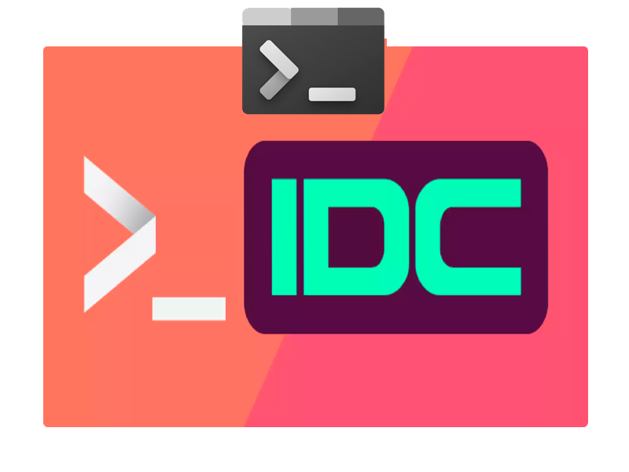

<div align="center">

```ocaml
NUNCA OMITIR / IGNORAR / EVITAR LEERME
```

</div>

<h1 align="center">
  <br>
  <a href="https://github.com/MOON-TYPE/mdev"></a>
  <br>
  MDev
  <br>
</h1>

<h4 align="center">Consola para Unity Engine con la que puedes llamar a comandos predefinidos anteriormente y llamarlos en <a href="https://docs.unity3d.com/2019.1/Documentation/Manual/ScriptingRuntimeUpgrade.html" target="_blank">tiempo de ejecucion</a>.</h4>

<p align="center">
  <a href="https://trello.com/b/u4dIlrP7">
    
  </a>
  <a href="https://unity.com/">
    
  </a>
  <a href="https://github.com/MOON-TYPE/mdev">
    
  </a>
</p>

<pre align="center">
  <a href="#descargar">DESCARGAR</a> • <a href="#colaboradores">COLABORADORES</a> • <a href="#licencia">LICENCIA</a>
</pre>
<h1>
  <a href="#--------">
  </a>
</h1>

<p align="center">
  <sup>
      
      <sup>
            Español,
            <a href="./README.md">Ingles</a>,
            <a href="./README.md">Chino (中文)</a>
      </sup>
  </sup>
</p>

<p align="center">
  
</p>

<p align="center">
  <em>Añade una consola de desarrollo completa a tu juego con solo una línea de código. <a href="https://github.com/MOON-TYPE/mdev">MDev</a>.</em>
</p>

## :octocat: ‎ <sup><sub><samp>¡HOLA! ¡GRACIAS POR VENIR!</samp></sub></sup>


Convierte cualquier método en un comando de consola al instante: perfecto para herramientas de depuración, menús de trucos, comandos de administración o atajos de desarrollo. Listo para usar y repleto de funciones.

Algunos detalles:
- Transforma cualquier método en un comando de terminal con una sola línea de código
- Autocompletado inteligente con sugerencias de parámetros
- Monitoreo y modificación de variables en tiempo real
- Atajos de teclado personalizables
- Numerosos comandos integrados útiles para empezar
- Acceso completo al código fuente
- Se puede usar solo para desarrolladores o implementar en reproductores. ¡Tú eliges!

Perfecto para:
- Comandos de depuración
- Controles de administración
- Menús de comandos/trucos
- Atajos de desarrollo
- Herramientas de prueba y control de calidad

¡Obtén la consola para desarrolladores del juego para disfrutar de una experiencia de desarrollo más rápida y potente!

<div align="center">

```ocaml
CLIC O TOQUE ❲☰❳ PARA VER EL ESPEJO
```

</div>
<p align="right">
  [<a href="https://gitlab.com/type-moon/mdev#">espejo</a>]
</p>             
  
## <samp>Descargar</samp>

| Nombre                                                                                                 | Version |
|:-----------------------------------------------------------------------------------------------------------|:------------------------------|
| MDev u6+                      | [v3.0](https://github.com/MOON-TYPE/mdev/releases/tag/3.0.0)    |
| MDev u2017+                     | [v2.0](https://github.com/MOON-TYPE/mdev/releases/tag/2.0.0)    |
| MDev u4+                      | [v1.0](https://github.com/MOON-TYPE/mdev/releases/tag/1.0.0)    |

  
## <samp>Colaboradores</samp>

1. ¡Bifurcalo!
2. Crea tu rama de características: `git checkout -b nueva-funcion`
3. Confirme sus cambios: `git commit -am 'Agregar funcionalidad'`
4. Empuje la rama: `git push origin nueva-funcion`
5. Envíe una pull request: D

El proyecto esta mantenido por [N9+](https://github.com/ninpl) con ayuda de los colaboradores ([lista](https://github.com/MOON-TYPE/mdev/graphs/contributors)).

<a href="https://github.com/MOON-TYPE/mdev/graphs/contributors">
  
</a>

## <samp>Agradecimientos</samp>

|                  |       | Inspiración y Recursos                               |      |                               Licencia                               |
| :--------------: | :---: | :--------------------------------------------------- | :--- | :------------------------------------------------------------------: |
|      Imagen      |   1   | [Kevin Hong](https://www.kevinhong.com/ffvii-church) |      | [CC BY-NC-SA 4.0](https://creativecommons.org/licenses/by-nc-sa/4.0) |
| contributors-img |   2   | [Suguru Inatomi](https://github.com/lacolaco)        |      |                             Sin Licencia                             |
|     Shields      |   3   | [Thaddée Tyl](https://github.com/espadrine)          |      | [CC0 LICENSE](https://github.com/badges/shields/blob/master/LICENSE) |
|   Unity-Chan SD   |   4   | [Unity-Chan](https://unity-chan.com/download/releaseNote.php?id=SDUnityChan&lang=en)          |      | [Unity-chan 3.0](https://unity-chan.com/contents/license_en/) |

## <samp>Politica de seguridad</samp>

[Leer](./SECURITY.md).

## <samp>Licencia</samp>

<pre align="center">
  <a href="https://github.com/MOON-TYPE/mdev/blob/master/LICENSE">MIT</a> • <a href="https://ninpl.com">ninpl.com</a> • <a href="https://github.com/ninpl">@ninpl</a>
</pre>

<pre align="center">
  <a href="#readme">VOLVER ARRIBA</a>
</pre>
